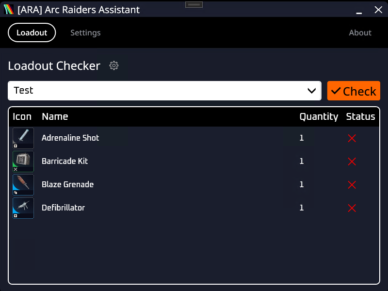
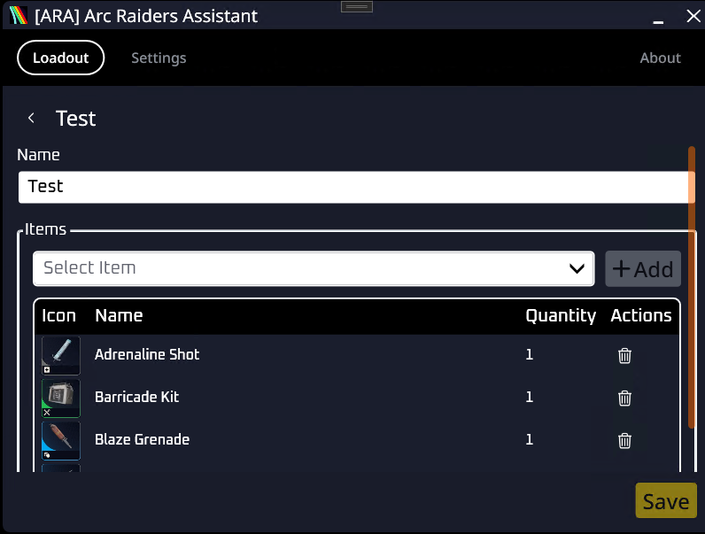

# ARA - Arc Raiders Assistant

Small app which helps you to create and check loadout before you start the adventure. (Maybe some additional features)

## System Requirements
Windows 11 x64

**IMPORTANT: Game should run in Windowed or Borderless Fullscreen modes!**

## Features

- Create and Check Loadout
- TBD

## Usage

1. Download the latest `ARA.exe` from the [Releases](https://github.com/skuzmin/ara/releases) page
2. Run it — no installation required

## License

Copyright 2026 Serhii Kuzmin

This project is licensed under the [MIT License](LICENSE).
